# EasyMed - Visual Entity Relationship Diagram

## Interactive ERD (Mermaid Diagram)

Copy the code below into any Mermaid-compatible viewer (GitHub, VS Code with Mermaid extension, or https://mermaid.live)

```mermaid
erDiagram
    USERS ||--o| DOCTORS : "has profile (role=doctor)"
    USERS ||--o| PATIENTS : "has profile (role=patient)"
    
    DOCTORS ||--o{ APPOINTMENTS : "schedules"
    DOCTORS ||--o{ DOCTOR_SCHEDULES : "defines"
    DOCTORS ||--o{ REVIEWS : "receives"
    DOCTORS }o--o{ LAB_OFFERS : "offers services"
    
    PATIENTS ||--o{ APPOINTMENTS : "books"
    PATIENTS ||--o{ REVIEWS : "writes"
    
    APPOINTMENTS ||--o{ PAYMENTS : "requires"
    
    LAB_OFFERS ||--o{ LAB_OFFER_DOCTORS : "linked to"
    DOCTORS ||--o{ LAB_OFFER_DOCTORS : "provides"

    USERS {
        int id PK
        string username UK
        string email UK
        string password
        string first_name
        string last_name
        string phone
        date date_of_birth
        string gender
        string role "admin, doctor, patient"
        boolean is_active
        string profile_image
        boolean email_verified
        datetime created_at
        datetime updated_at
    }

    DOCTORS {
        int id PK
        int user_id FK "→ USERS"
        string specialty
        string license_number
        int experience_years
        decimal consultation_fee
        text biography
        string schedule_days
        time schedule_time_start
        time schedule_time_end
        boolean is_available
        string phone
        datetime created_at
    }

    PATIENTS {
        int id PK
        int user_id FK "→ USERS"
        string phone
        date date_of_birth
        string gender
        text address
        string emergency_contact
        string emergency_phone
        string blood_type
        string status
        datetime created_at
    }

    APPOINTMENTS {
        int id PK
        int patient_id FK "→ PATIENTS"
        int doctor_id FK "→ DOCTORS"
        date appointment_date
        time appointment_time
        string status "pending, scheduled, completed, cancelled, no_show"
        text reason_for_visit
        json patient_info
        text notes
        string reference_number UK
        datetime created_at
        datetime updated_at
    }

    PAYMENTS {
        int id PK
        int appointment_id FK "→ APPOINTMENTS"
        decimal amount
        string payment_method
        string gcash_reference
        string receipt_path
        string payment_status "pending, verified, rejected"
        text payment_notes
        datetime paid_at
        datetime created_at
        datetime updated_at
    }

    REVIEWS {
        int id PK
        int patient_id FK "→ PATIENTS"
        int doctor_id FK "→ DOCTORS"
        int rating "1-5 stars"
        text review_text
        boolean is_anonymous
        boolean is_approved
        datetime created_at
        datetime updated_at
    }

    DOCTOR_SCHEDULES {
        int id PK
        int doctor_id FK "→ DOCTORS"
        int day_of_week "0-6 (Sun-Sat)"
        time start_time
        time end_time
        int slot_duration "minutes"
        boolean is_available
        datetime created_at
    }



    LAB_OFFERS {
        int id PK
        string title
        text description
        decimal price
        boolean is_active
        datetime created_at
        datetime updated_at
    }

    LAB_OFFER_DOCTORS {
        int id PK
        int lab_offer_id FK "→ LAB_OFFERS"
        int doctor_id FK "→ DOCTORS"
        datetime created_at
        datetime updated_at
    }


```



---

## How to View This Diagram

### Option 1: GitHub (Automatic)
If you're viewing this on GitHub, the diagram above will render automatically.

### Option 2: VS Code
1. Install the "Markdown Preview Mermaid Support" extension
2. Open this file and press `Ctrl+Shift+V` (or `Cmd+Shift+V` on Mac)

### Option 3: Online Viewer
1. Visit https://mermaid.live
2. Copy the mermaid code block above
3. Paste it into the editor
4. Export as PNG, SVG, or PDF

### Option 4: Export as Image
Use the Mermaid CLI to generate an image:
```bash
# Install mermaid-cli
npm install -g @mermaid-js/mermaid-cli

# Generate PNG
mmdc -i docs/ERD_VISUAL.md -o docs/ERD_DIAGRAM.png

# Generate SVG (vector, better quality)
mmdc -i docs/ERD_VISUAL.md -o docs/ERD_DIAGRAM.svg
```

---

## Legend

| Symbol | Meaning |
|--------|---------|
| `||--o|` | One-to-One relationship |
| `||--o{` | One-to-Many relationship |
| `}o--o{` | Many-to-Many relationship |
| `PK` | Primary Key |
| `FK` | Foreign Key |
| `UK` | Unique Key |

---

## Relationship Details

### Core Relationships:

1. **USERS to DOCTORS** (One-to-One)
   - A user with role='doctor' has one doctor profile

2. **USERS to PATIENTS** (One-to-One)
   - A user with role='patient' has one patient profile

3. **DOCTORS to APPOINTMENTS** (One-to-Many)
   - A doctor can have multiple appointments

4. **PATIENTS to APPOINTMENTS** (One-to-Many)
   - A patient can have multiple appointments

5. **APPOINTMENTS to PAYMENTS** (One-to-Many)
   - An appointment can have multiple payment records

6. **DOCTORS to LAB_OFFERS** (Many-to-Many)
   - Doctors can offer multiple lab services
   - Lab services can be offered by multiple doctors
   - Linked through LAB_OFFER_DOCTORS junction table

7. **DOCTORS to REVIEWS** (One-to-Many)
   - A doctor can receive multiple reviews

8. **PATIENTS to REVIEWS** (One-to-Many)
   - A patient can write multiple reviews

9. **DOCTORS to SCHEDULES** (One-to-Many)
   - A doctor can have multiple schedule entries

---

## Database Statistics

Based on the EasyMed system analysis:

- **Total Tables**: 9
- **Total Relationships**: 11+
- **Junction Tables**: 1 (LAB_OFFER_DOCTORS)
- **Database Type**: SQLite (with MySQL compatibility)
- **Foreign Key Enforcement**: Enabled

---

## Color Coding Suggestion for Diagram

When presenting or customizing the diagram, consider this color scheme:

- 🔵 **Blue**: User Management (USERS, DOCTORS, PATIENTS)
- 🟢 **Green**: Appointments & Operations (APPOINTMENTS, PAYMENTS)
- 🟡 **Yellow**: Scheduling (DOCTOR_SCHEDULES)
- 🟠 **Orange**: Laboratory Services (LAB_OFFERS, LAB_OFFER_DOCTORS)
- 🟣 **Purple**: Feedback (REVIEWS)
